Курсовое задание.
1) Роут отдающий деталку товара https://adresat.pro/catalog/sale-rooms/281035
2) Роуты необходимые для помещения товара в сравнение и удаление товара из сравнения
3) Роуты необходимые для помещения товара в избранное и удаление товара из избранного
4) Роут отдачи данных для страницы сравнения https://adresat.pro/compare/
5*) Роут отдачи данных для страницы избранного

Аутентификация происходит по токену через laravel passport За регистрацию и авторизацию отвечает контроллер
UserAuthController.
Роут на регистрацию и выдачу токена http://site_name/api/register
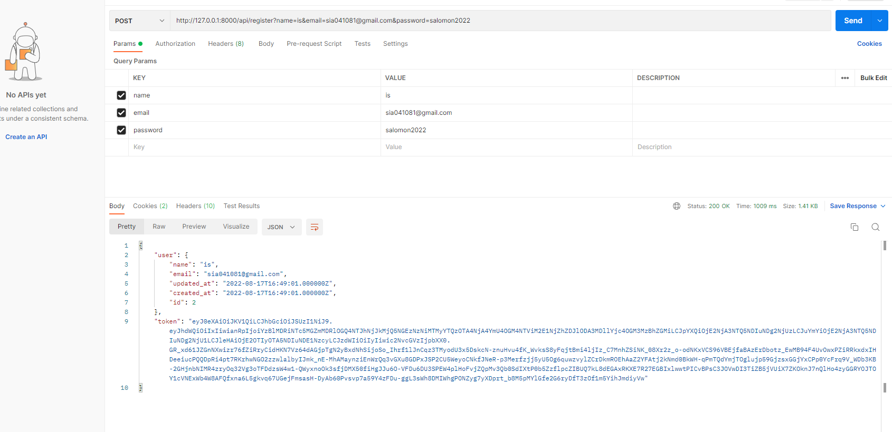
Роут на авторизацию и выдачу токена http://site_name/api/login

Так же создан ресурсный api HomeController который отвечает за создание сущности удаление обновление
и вывод как одной так всех.
1. Роут на весь каталог  http://site_name/api/v1/catalog/
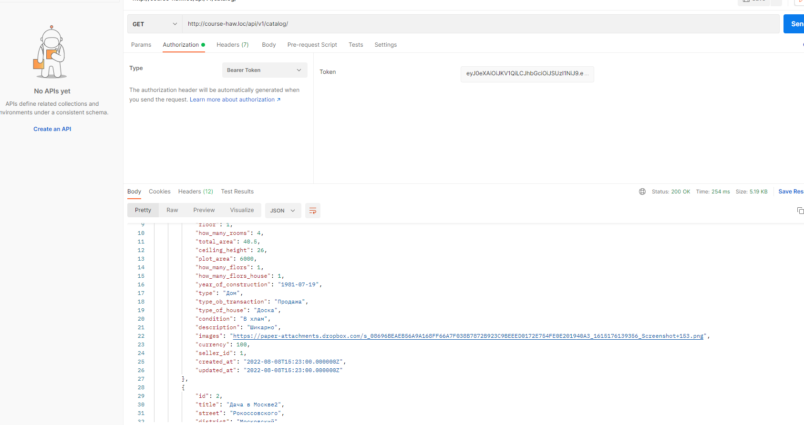
2. Роут на детальную страницу http://site_name/api/v1/catalog/{id}
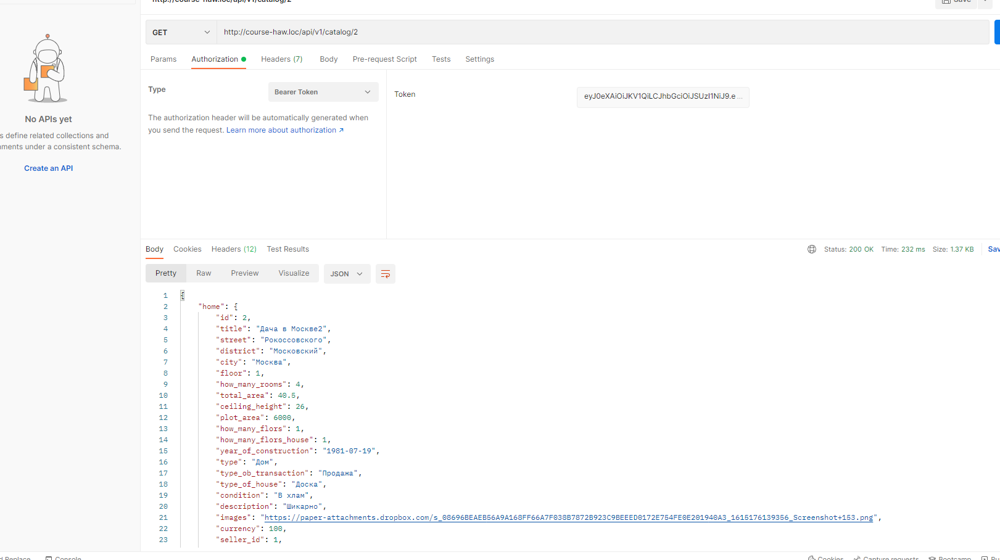
3. Роут на добавление товара http://site_name/api/v1/catalog/add method post 
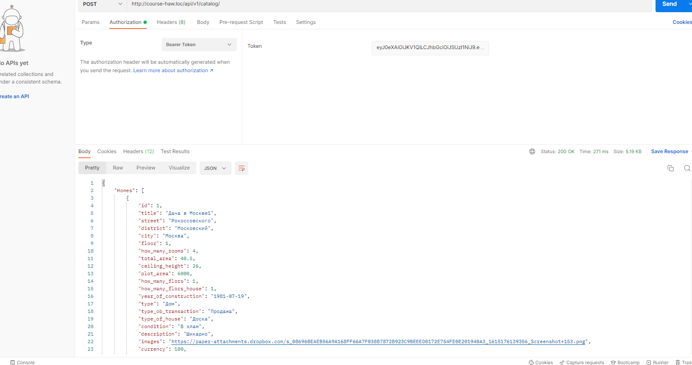
4. Роут на обновление товара http://site_name/api/v1/catalog/uppdate/{id} method path

5. Роут на удаление товара http://site_name/api/v1/catalog/delete/{id} method delete

Вывод всех сущностей кэшироуется в редис, также добавлен наблюдатель который при добавлении нового
объявления очищает кэш.

Сделаны роуты и создан соответствующий контроллер для помещения товара в избранное удаление и 
вывода id избранных товаров. Так же вывод всух избранных кешируется в редис и при добавлении нового
эллемента кеш очищается.
1. Просмотр всех избранных http://site_name/api/v1/favorite/

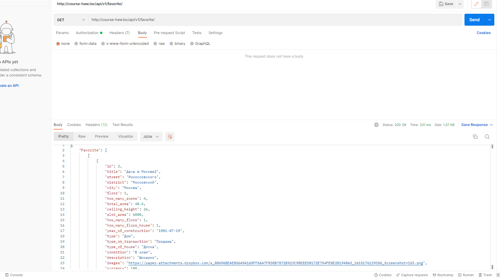
2. Добавление товара в избранное http://site_name/api/v1/favorite/add method post в request передается id товара
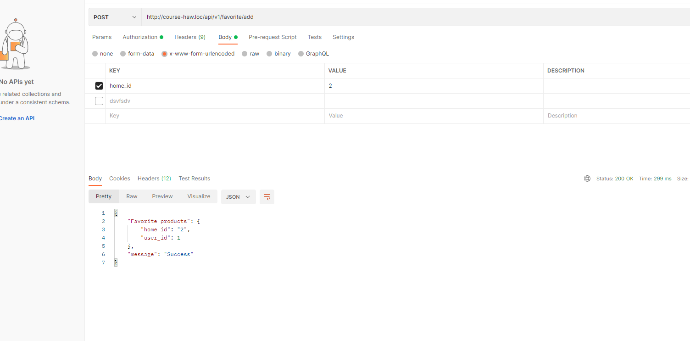
3. Удаление товара из избранного http://site_name/api/v1/favorite/delete method delete
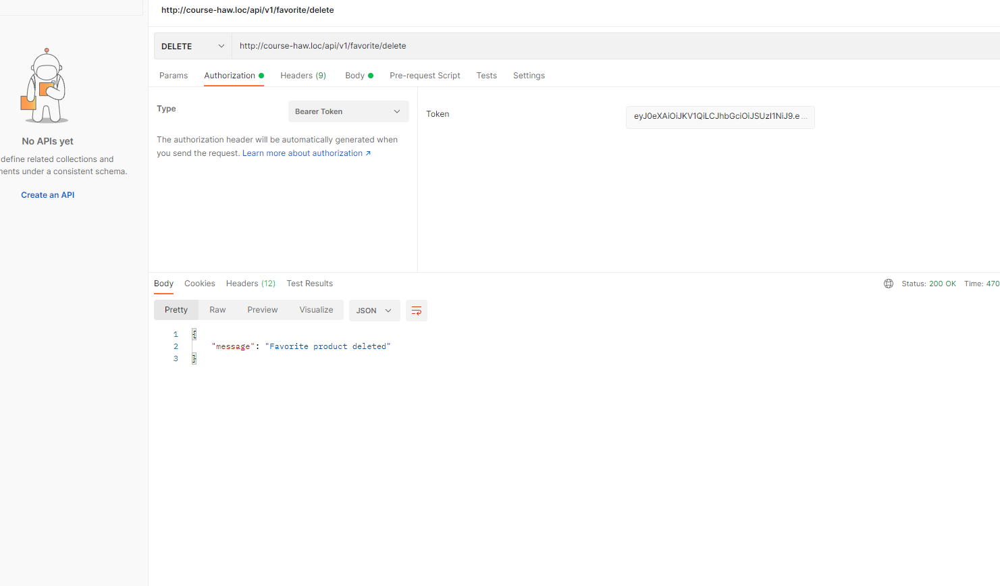
За вывод, добавление, удаления и очистки товаров сравнения отвечает CompareController
1. Просмотр страницы сравнения http://site_name/api/v1/compare
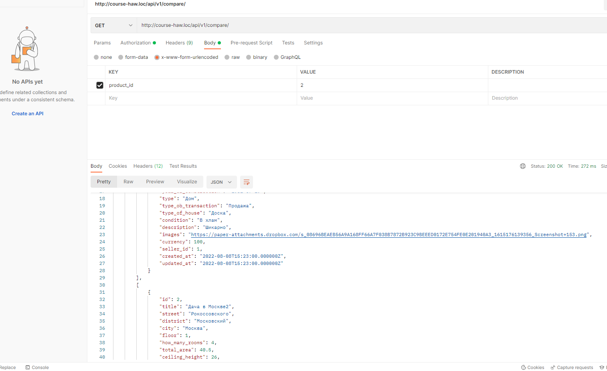
2. Добавление товара в сравнение http://site_name/api/v1/compare/add method post в request передается 
id товара
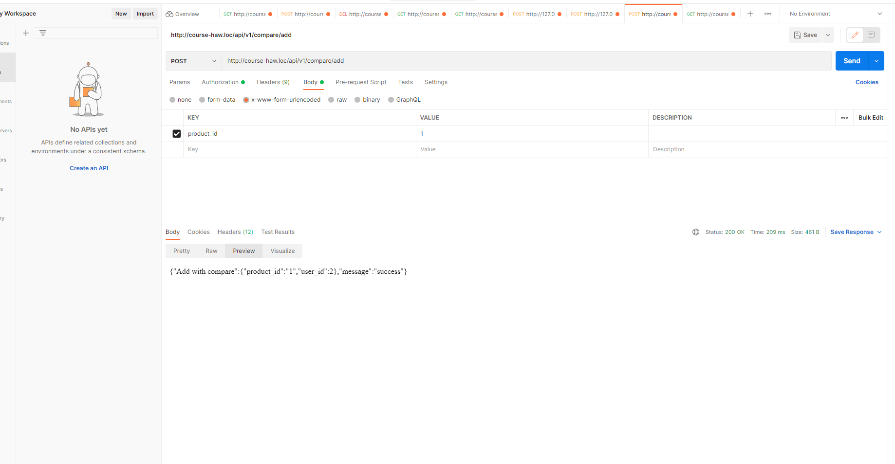
3. Для очистки страницы сравнения роут http://site_name/compare/destroy method delete
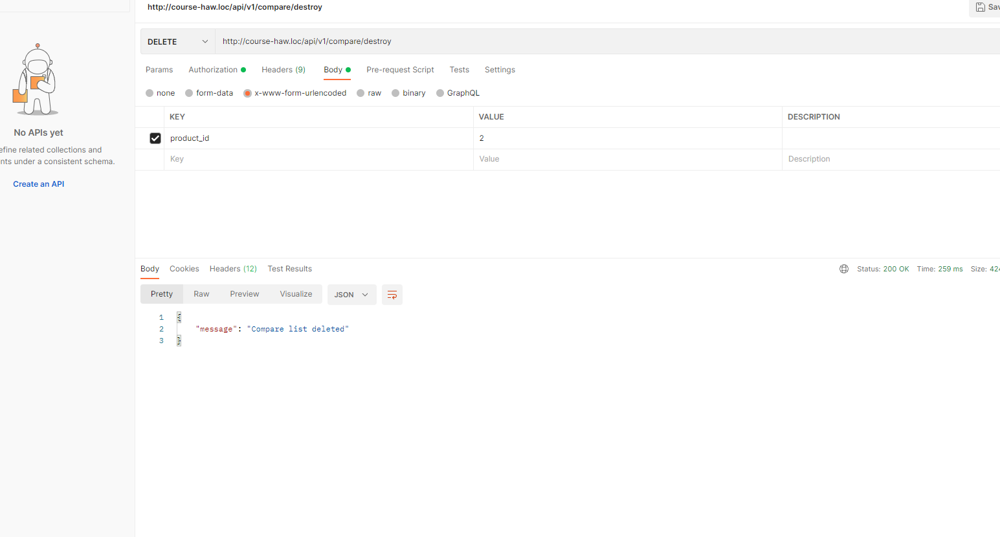
4. Для удаления одного товара из сравнения роут http://site_name/api/v1/compare/del method delete в request
передаётся id товара
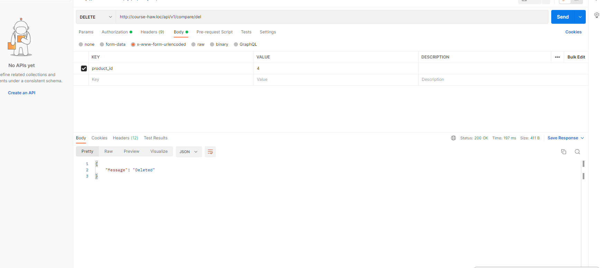

